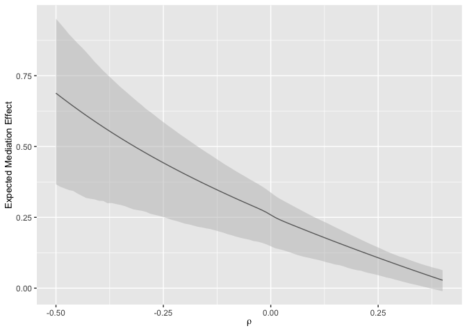

README
================
Michael B. Sohn
7/05/2021

## CMMB: Compositional Mediation Model for Binary Outcomes

The cmmb function estimates direct and indirect effects of treatment on
binary outcomes mediated through a compositional mediator that consists
of multiple components. For detailed information about the arguments,
please see the documentation for *cmmb()*.

Note: the number of components can be high-dimensional. However, it will
be computationally intensive to run it with high-dimensional components
as it tests the indirect effect using debiased bootstrap estimates based
on 2,000 (in default) random samplings.

### Installation

install.packages(“devtools”)

devtools::install\_github(“mbsohn/cmmb”)

### Example: estimate direct and total indirect effects

``` r
### load functions used in data generation and performance comparison
library(cmmb)
source("comparators.R")
### Generate a simulated dataset of 50 samples and 5 taxa
set.seed(2021)
### The gen.cmm.sim.data function simulates data based on the logistic normal distribution. 
### The first argument takes the number of samples and the second takes the number of components
### (taxa). By default, both direct and indirect effects are significantly different from zero.
sim.dat <- gen.cmm.sim.data(50, 5)
### Run CMM for binary outcomes
rslt <- cmmb(Y=sim.dat$Y, M=sim.dat$M, tr=sim.dat$tr, X=sim.dat$X)
rslt
```

    ## $total
    ##       Estimate Lower Limit Upper Limit
    ## DE   0.1831665   0.1206513   0.2885970
    ## TIDE 0.2585639   0.1525723   0.3321615
    ## 
    ## $cwprod
    ##           Estimate Lower Limit Upper Limit
    ## taxon1  0.45250088   0.0643407   0.7435297
    ## taxon2  0.00179244  -0.2030688   0.1593904
    ## taxon3 -0.20841877  -0.5068055   0.1638699
    ## taxon4  0.61865737  -0.1058526   1.1229078
    ## taxon5  0.51405582  -0.4161137   1.1703481
    ## 
    ## attr(,"class")
    ## [1] "cmmb"

``` r
### Plot products of component-wise path coefficients
plot_cw_ide(rslt)
```

<!-- -->

### Example: sensitivity analysis for the total indirect effect

``` r
rslt.sa <- cmmb(Y=sim.dat$Y, M=sim.dat$M, tr=sim.dat$tr, X=sim.dat$X, ForSA=TRUE)
### Plot sensitivity of the estimated total indirect effect
plot_cmmb_sa(rslt.sa)
```

<!-- -->

### Performance comparison

Note: By default, the *gen.cmm.sim.data* function simulates data such
that both direct and indirect effects are significantly different from
zero.

``` r
sim.dat <- gen.cmm.sim.data(50, 5)
PCS(Y=sim.dat$Y, M=sim.dat$M, tr=sim.dat$tr, X=sim.dat$X)
```

    ##       Estimate Lower Limit Upper Limit
    ## DE   0.8585578   -1.011952    1.807630
    ## TIDE 0.5737664   -2.550865    2.263679

``` r
PCP(Y=sim.dat$Y, M=sim.dat$M, tr=sim.dat$tr, X=sim.dat$X)
```

    ##        Estimate Lower Limit Upper Limit
    ## DE   0.16603048  0.09844733  0.34177689
    ## TIDE 0.01797279 -0.15262002  0.07936442

``` r
cmmb(Y=sim.dat$Y, M=sim.dat$M, tr=sim.dat$tr, X=sim.dat$X)$total
```

    ##       Estimate Lower Limit Upper Limit
    ## DE   0.1615200  0.11897322   0.2372022
    ## TIDE 0.1003837  0.02902102   0.1425433
